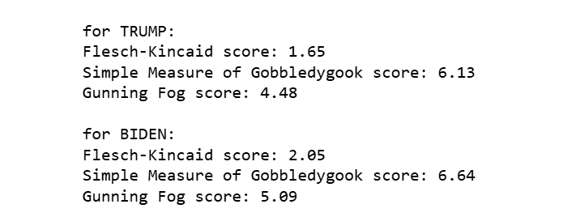
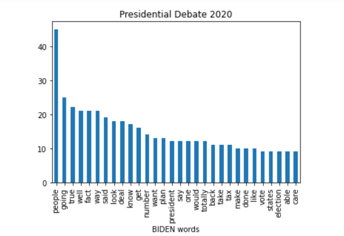
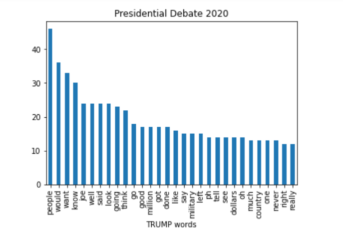

  # Natural Language Processing Program
  

  
  ## Table of Contents
   * [Description](#description)
   * [Screenshots](#screenshots)
   * [License](#license)

  ## Description
  This application allows the user to process a text file to learn some information about it. This example processes the 2020 presidential debate between Trump and Biden, first splitting the text into two separate speakers before analysis. Then the app returns a list of the top 30 most often used words by each presidential candidate, a bar chart displaying these words and their frequencies, and some readability scores to determine the "reading level" of each participant's words of the debate.

  ## Screenshots
  
  
  

  ## License
  
   MIT License

    Copyright (c) 2025 Emily

    Permission is hereby granted, free of charge, to any person obtaining a copy
    of this software and associated documentation files (the "Software"), to deal
    in the Software without restriction, including without limitation the rights
    to use, copy, modify, merge, publish, distribute, sublicense, and/or sell
    copies of the Software, and to permit persons to whom the Software is
    furnished to do so, subject to the following conditions:
    
    The above copyright notice and this permission notice shall be included in all
    copies or substantial portions of the Software.
    
  [https://opensource.org/licenses/MIT](https://opensource.org/licenses/MIT)
  
